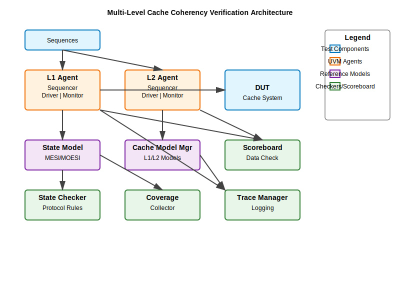

# Multi-Level Cache Coherency Verification Environment


---

## Table of Contents
- [Project Overview](#project-overview)
- [Project Objectives](#project-objectives)
- [Verification Methodology](#verification-methodology)
- [Testbench Structure](#testbench-structure)
- [Directory Map](#directory-map)
- [Test Plan & Scenarios](#test-plan--scenarios)
- [Running the Regression Suite](#running-the-regression-suite)
- [Coverage & Reporting](#coverage--reporting)
- [Debug & Trace Support](#debug--trace-support)
- [Author & Credits](#author--credits)

---

## Project Overview
This repository contains a reusable UVM-based verification environment targeting multi-level cache coherency. The testbench models MESI/MOESI behavior across L1 and L2 caches, providing agents, stateful functional models, robust scoreboards, and automated regression tooling so reviewers can evaluate coherency correctness end-to-end.

### Architecture Diagram



```mermaid
graph TB
    subgraph "Test Layer"
        SEQ[Coherence Sequences<br/>State Walk, Upgrade, Conflict]
    end
    
    subgraph "Agent Layer"
        L1[L1 Agent<br/>Sequencer | Driver | Monitor]
        L2[L2 Agent<br/>Sequencer | Driver | Monitor]
    end
    
    subgraph "DUT"
        CACHE[Multi-Level Cache<br/>L1/L2 Hierarchy]
    end
    
    subgraph "Reference Models"
        STATE[State Model<br/>MESI/MOESI Tracker]
        FUNC[Cache Model Mgr<br/>Functional Cache Models]
    end
    
    subgraph "Verification Components"
        SB[Scoreboard<br/>Data Consistency Check]
        CHK[State Checker<br/>Protocol Compliance]
        COV[Coverage Collector<br/>Functional Coverage]
        TRACE[Trace Manager<br/>Transaction Logging]
    end
    
    SEQ -->|stimulus| L1
    SEQ -->|stimulus| L2
    L1 -->|drive| CACHE
    L2 -->|drive| CACHE
    CACHE -->|observe| L1
    CACHE -->|observe| L2
    L1 -->|events| STATE
    L2 -->|events| STATE
    L1 -->|events| FUNC
    L2 -->|events| FUNC
    STATE -->|validate| CHK
    FUNC -->|compare| SB
    L1 -->|coverage| COV
    L2 -->|coverage| COV
    L1 -->|trace| TRACE
    L2 -->|trace| TRACE
```

## Project Objectives
- Demonstrate protocol compliance for MESI/MOESI caches interacting over shared interconnects.
- Guarantee single-Modified ownership, timely invalidations, and consistent data visibility across cores.
- Stress concurrency, contention, and race conditions with both directed and randomized sequences.
- Capture functional coverage for states, transitions, sharer counts, and error scenarios to measure verification completeness.

## Verification Methodology
- **UVM Environment:** L1 and L2 cache agents populate sequence, driver, monitor, and analysis paths. A shared `cache_state_model` keeps all components aligned on coherence state.
- **Golden Models:** `cache_model_mgr` hosts cycle-approximate functional cache models that mirror real cache hierarchy behavior, enabling scoreboard comparisons for data integrity and state transitions.
- **Scoreboards & Checkers:** `cache_scoreboard`, `coh_state_checker`, and `coh_data_checker` cross-check observed transactions, flag illegal state transitions, and catch data mismatches or multi-owner violations.
- **Coverage:** `coh_coverage_collector` and `coh_error_coverage` gather protocol, transaction, multi-level, and error coverage metrics, feeding UCDB/URG/IMC reports.
- **Automation:** `scripts/run_uvm_regression.ps1` compiles and executes the suite across Questa, VCS, or Xcelium, enabling `+COH_SEQ=<sequence>` overrides and merging coverage results automatically.

## Testbench Structure
- **Top Level (`top_tb.sv`):** Connects the DUT placeholder, cache interfaces, and seeds UVM configuration with virtual interfaces.
- **Environment (`cache_env`):** Instantiates agents, scoreboard, checkers, coverage collectors, and the trace manager. Shared models are injected through the configuration database for consistent state tracking.
- **Agents (`l1_agent`, `l2_agent`):** Each bundles a sequencer, driver, and monitor. Drivers implement protocol handshakes; monitors publish fully annotated `cache_coh_item`s (address, data, transaction type, states, sharer vectors, core IDs).
- **Sequences:** Directed sequences (`coh_state_walk_seq`, `coh_upgrade_seq`) and randomized sequences (`coh_conflict_seq`, `coh_random_seq`) combine in `coh_full_transition_vseq` to traverse all legal state transitions and contention scenarios.
- **Trace Manager:** `cache_trace_mgr` writes CSV-style transaction traces with automatic compression and rotation to support root-cause analysis during long regressions.

## Directory Map
- `rtl/` - DUT stubs or bindings (placeholder DUT supplied in `top_tb.sv`).
- `uvm_tb/` - Core UVM environment: interfaces, packages, agents, sequences, environment, and top-level testbench.
- `models/` - Functional cache models (`cache_model_pkg`, `functional_cache_model`, `cache_model_mgr`).
- `scripts/` - Automation utilities, notably `run_uvm_regression.ps1` with simulator-specific flows.
- `docs/` - Supporting documentation such as `verification_plan.md`.
- `logs/` - Simulation logs and compressed trace outputs per run (generated by the regression script).
- `results/` - Coverage databases (`regression.ucdb`) and summarized reports (`coverage_report.txt`).

## Test Plan & Scenarios
- **State Walk:** Traverses the sequence `I -> E -> M -> O -> S -> I` to validate downgrade and eviction paths.
- **Upgrade Contention:** Concurrent cores fight for Modified ownership while L2 snoops issue invalidations.
- **Conflict Storm:** Random loops generate evictions, invalidates, and writebacks under heavy thrash.
- **Mixed Directed + Random:** Deterministic flow on one core with randomized stress on another to expose race conditions.
- **DMA/Peer Access:** Optional sequence hooks support non-core masters issuing BUS_RD/RDX transactions.
- **Flush-In-Motion:** Writebacks interleaved with live readers to confirm eviction coherency.

## Running the Regression Suite
1. Install and license your preferred simulator (Questa, VCS, or Xcelium) and set environment variables (for example, `QUESTA_HOME`).
2. From the repository root, launch the regression script:
   ```powershell
   pwsh scripts\run_uvm_regression.ps1 -simTool questa -runs 5 -clean
   ```
   Replace `-simTool` with `vcs` or `xcelium` to switch toolchains.
3. The script compiles with `+cover=bcesf`, runs each sequence with multiple seeds, compresses trace logs, and stores results under `sim/`.
4. Override individual coherence scenarios by passing `+COH_SEQ=<sequence_name>` (handled automatically per regression entry).

## Coverage & Reporting
- UCDB (or simulator equivalent) files merge into `results\regression.ucdb`.
- A detailed coverage summary is generated at `results\coverage_report.txt`, including protocol transitions, sharer counts, and error bins.
- Any protocol violations or data mismatches appear as `uvm_error` messages in the run logs and feed error coverage bins.

## Debug & Trace Support
- Transaction traces (`cache_trace_<test>_<seed>_*.log.zip`) record agent, core ID, transaction type, states, sharer count, and data for each observed event.
- Shared models (`cache_state_model`, `cache_model_mgr`) can be queried during debug to reconstruct coherence state at any point in the simulation.
- Scoreboard and checker messages include address, expected versus observed state/data, and owning agent to speed diagnosis.

## Author & Credits
Created by Teja Raghuveer. Inspired by collaborative CPU verification efforts that emphasize rigorous coherency validation. Feedback and collaboration are welcome; feel free to open issues or reach out for integration guidance.
